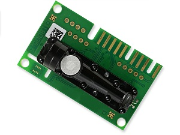
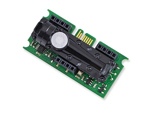
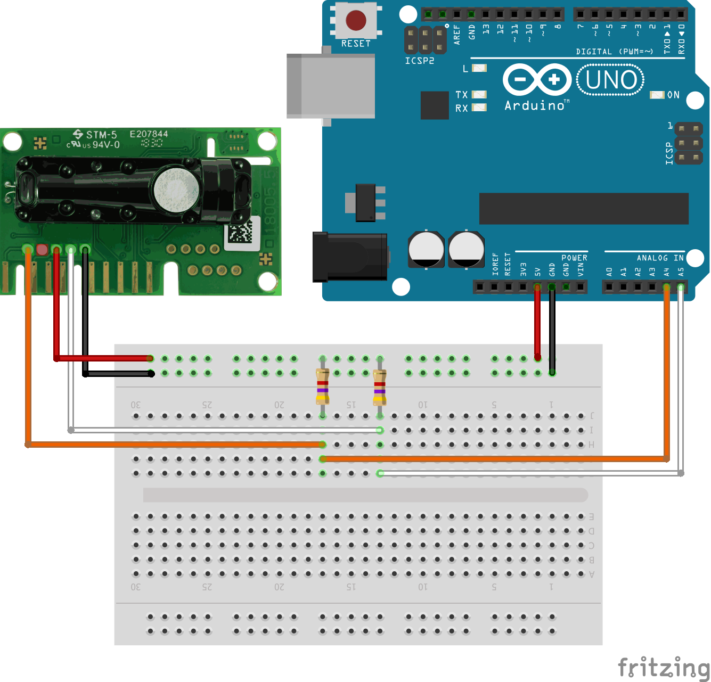
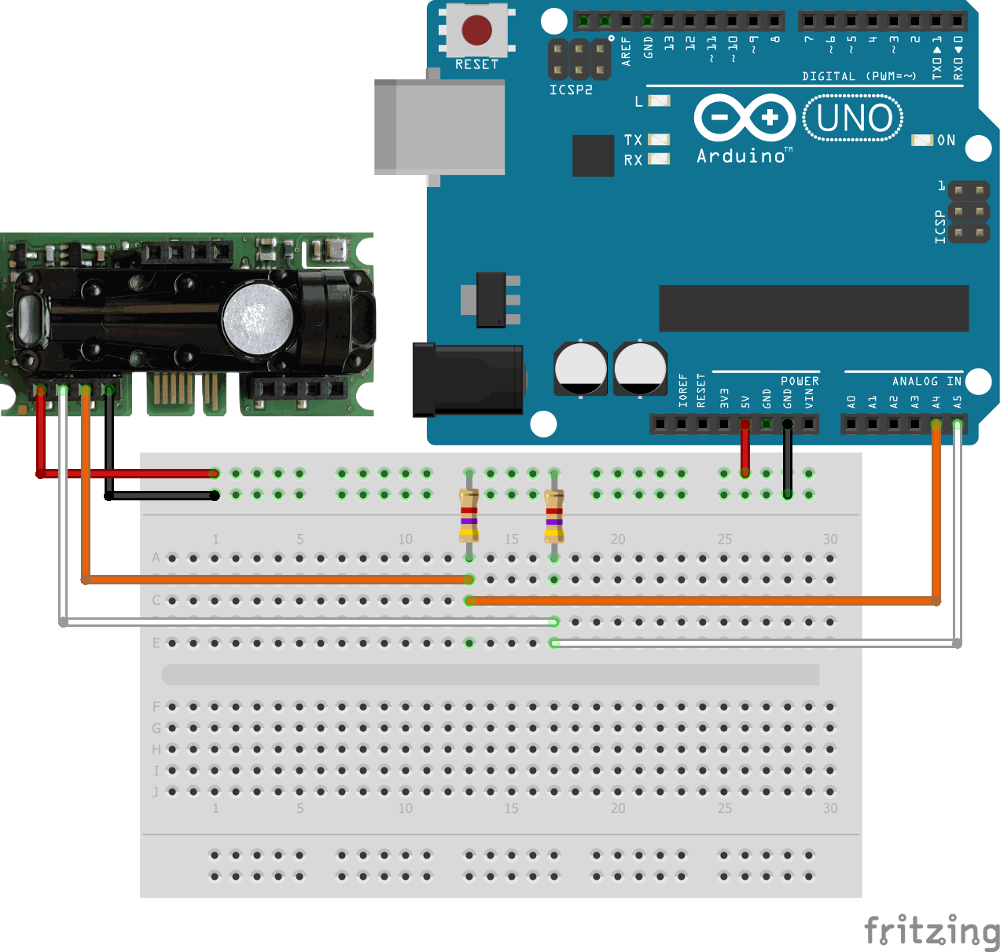
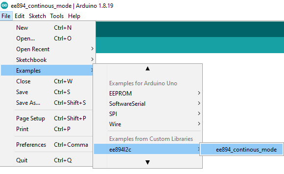

# EE894 I2C with Arduino

|Standard | Compact|
|------------ | ------------|
| | |

       
 

## QUICK START GUIDE  

### Components 
- EE894
- Arduino
- Breadboard 
- 2 x (1 kΩ - 10 kΩ) pull-ups
- Wire jumper cable  

| Step |                                                                                                                                                             |
|------|-------------------------------------------------------------------------------------------------------------------------------------------------------------|
| 1    | Connect the EE894 sensor module with Arduino according to the following scheme:   __Standard:__   __Compact:__ |
| 2    | Download and install the Arduino IDE (https://www.arduino.cc/en/software). Version >1.8.7 recommended.                                                            |
| 3    | Download the ZIP File of this project.|
| 4    | Open the arduino software.|
| 5    | Go to:   |
| 6    | Search for the downloaded ZIP File and open it.|
| 7    | Go to: |
| 8    | Connect the Arduino to your PC via the USB cable. Select Board “Arduino Uno” and the appropriate COM-Port from Tools menu and upload the sketch |
| 9    | When the upload is finished, open the the "Serial Monitor" with the key combination (Control + Shift + M) or via the menu bar:    |

 

## License 
See [LICENSE](LICENSE).
